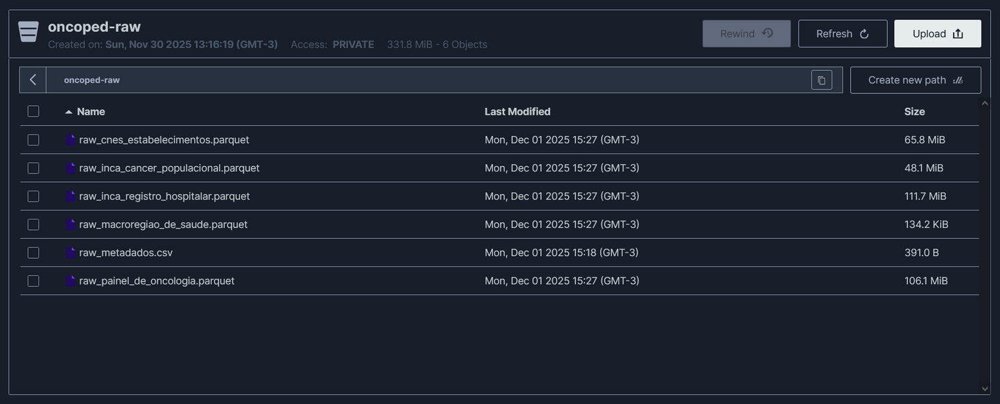
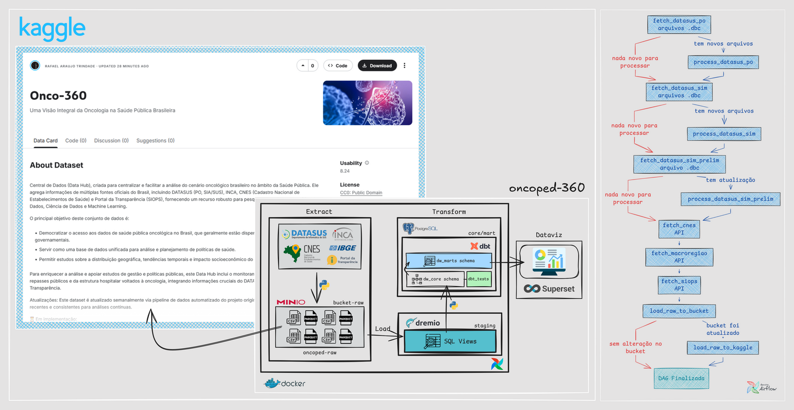

# 🎗️ oncoped-360
`em desenvolvimento`

Monitoramento de atendimentos, repasses públicos e estrutura hospitalar voltados à oncologia infantojuvenil no Brasil, integrando dados do DATASUS, INCA, CNES e Portal da Transparência.

---

## 🧱 Infraestrutura

Abaixo está a visão geral da stack de dados utilizada no projeto:

| Camada                         | Ferramenta       | Descrição                                                                 |
|--------------------------------|------------------|---------------------------------------------------------------------------|
| Orquestração / ETL            | Apache Airflow   | Orquestra pipelines de dados, automatiza tarefas e gerencia dependências. |
| Data Lake (S3-compatible)     | MinIO            | Armazenamento de objetos compatível com S3 para o Data Lake.             |
| Lakehouse / Query Engine      | Dremio           | Engine de consultas para dados no Data Lake/Lakehouse.                   |
| Modelagem / Transformação     | dbt Labs         | Modelagem de dados e transformações SQL orientadas a versionamento.      |
| Data Warehouse                | PostgreSQL       | Armazena dados estruturados otimizados para análise.                     |
| Visualização                  | Apache Superset  | Camada de visualização e dashboards para exploração dos dados.           |

---

## 🛠️ Arquitetura da Pipeline de Dados

---

## 🪣 Bucket MinIO (Data Lake) `em implementação`

`raw_cnes_estabelecimentos.parquet` – base bruta do CNES (Cadastro Nacional de Estabelecimentos de Saúde) com informações dos estabelecimentos de saúde no Brasil, incluindo tipo de unidade, gestão, endereço, município, esfera administrativa e outros atributos. *(quando disponível, atualização semanal)*

`raw_inca_cancer_populacional.parquet` - base bruta do INCA com registros populacionais de câncer entre 1988 e 2021, contendo informações sociodemográficas, clínicas, diagnósticas e de seguimento dos pacientes, incluindo dados sobre topografia, morfologia, estadiamento, tratamento e desfecho vital. *(versão estática - 1988 a 2021)*

`raw_inca_registro_hospitalar.parquet` – base bruta dos Registros Hospitalares de Câncer (RHC/INCA), com informações de casos atendidos em hospitais habilitados, incluindo variáveis sociodemográficas, clínicas, diagnósticas, terapêuticas e de seguimento dos pacientes oncológicos no âmbito hospitalar. *(versão estática – 1985 a 2023)*

`raw_macroregiao_de_saude.parquet` – lista de municípios com as informações de macrorregião e região de saúde. *(quando disponível, atualização semanal)*

`raw_painel_de_oncologia.parquet` – base bruta do Painel de Oncologia do SUS, com dados de diagnósticos e tratamentos oncológicos desde 2013. *(atualização mensal)*

`raw_siops_exec_rreo.parquet` – base bruta estadual das despesas do RREO (Relatório Resumido da Execução Orçamentária) do SUS, com dados desde 2020. *(atualização semestral)*

`raw_siops_exec_saude.parquet` – base bruta estadual da Despesa total em saúde por fonte e subfunção do SUS, com dados desde 2020. *(atualização semestral)*

`raw_siops_indicadores.parquet` – base bruta estadual de indicadores de saúde do SUS, com dados desde 2013. *(atualização semestral)*

`raw_sistema_info_mortalidade_prelim.parquet` – base preliminar do último ano disponível no SIM/SUS (Sistema de Informação sobre Mortalidade), com registros de óbitos no Brasil, provenientes das declarações de óbito do DATASUS. *(quando disponível, atualização semanal)*

`raw_sistema_info_mortalidade.parquet` – base bruta consolidada do SIM/SUS (Sistema de Informação sobre Mortalidade), com registros de óbitos no Brasil desde 2016 (Dados Consolidados CID10), provenientes das declarações de óbito do DATASUS. *(atualização anual)*

`raw_metadados.csv` – arquivo de metadados gerado automaticamente pelo pipeline, com histórico das extrações, incluindo nome do arquivo, data/hora da extração, número de registros e tamanho (em MiB) de cada dataset presente no Data Lake. *(atualização semanal)*

---

### ☁️ Integração com Kaggle [Onco-360](https://www.kaggle.com/datasets/rafatrindade/onco-360)

Atualização automática do dataset público [Onco-360](https://www.kaggle.com/datasets/rafatrindade/onco-360) no Kaggle a partir do pipeline no Airflow, garantindo que todos os dados processados estejam sempre sincronizados e disponíveis para análise.  

---

## 📄 Relatório de Execução do Projeto:

`scripts/extract/datasus/fetch_datasus_po.py`  

- ✅ Download e atualização incremental dos arquivos `.dbc` do DATASUS (Painel de Oncologia), conectando ao FTP público (`ftp.datasus.gov.br/dissemin/publicos/PAINEL_ONCOLOGIA/DADOS`).  
- ✅ Verificação de integridade por tamanho: se o `.dbc` já existir com o mesmo tamanho do FTP, é pulado; se o tamanho for diferente, é rebaixado (substituído).
- ✅ Pensado para ser executado de forma recorrente (orquestração/pipeline) para manter o repositório de DBC sempre atualizado.

---

`scripts/extract/datasus/process_datasus_po.py`  

- ✅ Conversão automatizada de arquivos `.dbc` para `.dbf` usando a biblioteca `datasus-dbc` (Python), com processamento iterativo para melhor performance.
- ✅ Geração de um único dataset consolidado:
  - `data/raw/raw_painel_de_oncologia.parquet`

---

`scripts/extract/datasus/fetch_datasus_sim.py`  

- ✅ Download e atualização incremental dos arquivos `.dbc` do SIM DATASUS (Sistema de Informação de Mortalidade) Dados Consolidados CID10, conectando ao FTP público (`ftp.datasus.gov.br/dissemin/publicos/SIM/CID10/DORES`).  
- ✅ Verificação de integridade por tamanho: se o `.dbc` já existir com o mesmo tamanho do FTP, é pulado.
- ✅ Pensado para ser executado de forma recorrente (orquestração/pipeline) para manter o repositório de DBC sempre atualizado.

---

`scripts/extract/datasus/process_datasus_sim.py`  

- ✅ Conversão automatizada de arquivos `.dbc` para `.dbf` usando a biblioteca `datasus-dbc` (Python), com processamento iterativo para melhor performance.
- ✅ Geração de um único dataset consolidado:
  - `data/raw/raw_sistema_info_mortalidade.parquet`

---

`scripts/extract/datasus/fetch_datasus_sim_prelim.py`  

- ✅ Download e atualização incremental dos arquivos `.dbc` do SIM DATASUS (Sistema de Informação de Mortalidade) Dados Preliminares, conectando ao FTP público (`ftp.datasus.gov.br/dissemin/publicos/SIM/PRELIM/DORES`).  
- ✅ Verificação de integridade por tamanho: se o `.dbc` já existir com o mesmo tamanho do FTP, é pulado. Senão, sobrescreve.
- ✅ Pensado para ser executado de forma recorrente (orquestração/pipeline) para manter o repositório de DBC sempre atualizado.
- ✅ Geração de tres datasets consolidados:
  - `data/raw/raw_siops_exec_rreo.parquet`
  - `data/raw/raw_siops_exec_saude.parquet`
  - `data/raw/raw_siops_indicadores.parquet`

---

`scripts/extract/datasus/process_datasus_sim_prelim.py`  

- ✅ Conversão automatizada de arquivos `.dbc` para `.dbf` usando a biblioteca `datasus-dbc` (Python), com processamento iterativo para melhor performance.
- ✅ Geração de um único dataset consolidado:
  - `data/raw/raw_sistema_info_mortalidade_prelim.parquet`

---

`scripts/extract/dados_abertos/fetch_siops_orcamento_publico.py`

- ✅ Baixa dados do SIOPS (Subfunção, RREO e Indicadores) via API pública.
- ✅ Organiza CSVs por UF e período e gera Parquets consolidados em `data/raw`.
- ✅ Remove coluna `municipio` e suporta execução manual ou via Airflow DAG.

---

`scripts/load/load_raw_to_bucket.py`  

- ✅ Geração e atualização do arquivo de metadados `raw_metadados.csv` a partir dos arquivos da pasta `data/raw` no ambiente do Airflow (`/opt/airflow/data`).  
- ✅ Criação automática do bucket `oncoped-raw` no MinIO (se não existir) e upload de **todos os arquivos** da pasta `data/raw` (incluindo `raw_metadados.csv`) via API S3 (`boto3`).  

---

`scripts/load/load_raw_to_kaggle.py`  

- ✅ Atualização automática do dataset público [onco-360](https://www.kaggle.com/datasets/rafatrindade/onco-360) via API do Kaggle.
- ✅ Integrado ao pipeline do Airflow, garantindo que o Kaggle esteja sempre sincronizado com os dados processados.

---

## 📦 Bibliotecas Utilizadas:

| Pacote              | Versão       | Observação                                                                       |
|---------------------|-------------|----------------------------------------------------------------------------------|
| **pandas**          | 2.3.3       | Manipulação e transformação de dados                                             |
| **dbfread**         | 2.0.7       | Leitura de arquivos `.dbf` gerados pelo DATASUS                                  |
| **boto3**           | 1.28.17     | Integração com API S3/MinIO para upload de arquivos                              |
| **dbt-postgres**    | 1.6.1       | Modelagem e transformação de dados no warehouse PostgreSQL usando dbt            |
| **psycopg2-binary** | 2.9.7       | Driver PostgreSQL utilizado para conexão com o banco de dados                    |
| **datasus-dbc**     | 0.1.3       | Descompressão de arquivos `.dbc` do DATASUS em `.dbf` via bindings em Python     |
| **pyarrow**         | 11.0.0      | Suporte à leitura e escrita de arquivos Parquet                                  |
| **python-dotenv**   | latest      | Carregamento de variáveis de ambiente a partir de arquivos `.env`                |
| **kaggle**          | 1.7.4.5     | Integração com a API do Kaggle para upload e gerenciamento de datasets           |