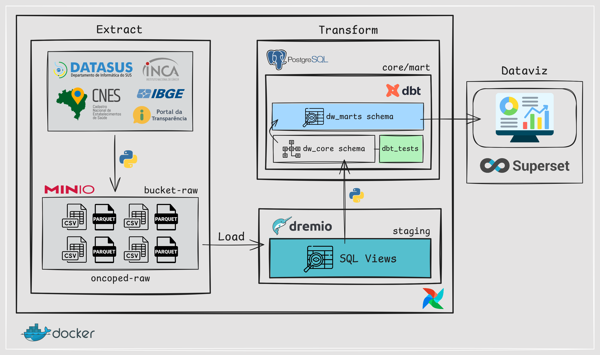
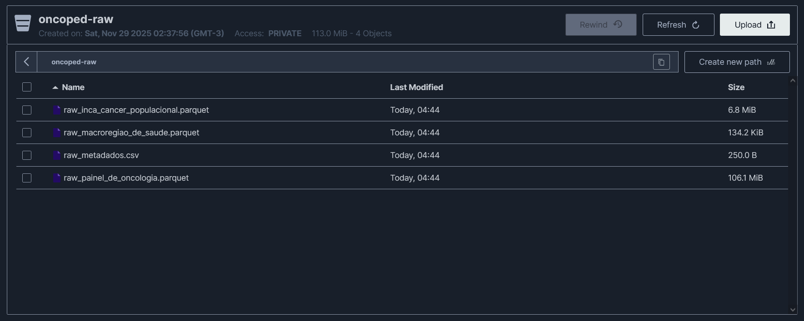

# 🎗️ oncoped-360
`em desenvolvimento`

Monitoramento de atendimentos, repasses públicos e estrutura hospitalar voltados à oncologia infantojuvenil no Brasil, integrando dados do DATASUS, INCA, CNES e Portal da Transparência.

---

## 🧱 Infraestrutura

Abaixo está a visão geral da stack de dados utilizada no projeto:

| Camada                         | Ferramenta       | Descrição                                                                 |
|--------------------------------|------------------|---------------------------------------------------------------------------|
| Orquestração / ETL            | Apache Airflow   | Orquestra pipelines de dados, automatiza tarefas e gerencia dependências. |
| Data Lake (S3-compatible)     | MinIO            | Armazenamento de objetos compatível com S3 para o Data Lake.             |
| Lakehouse / Query Engine      | Dremio           | Engine de consultas para dados no Data Lake/Lakehouse.                   |
| Modelagem / Transformação     | dbt Labs         | Modelagem de dados e transformações SQL orientadas a versionamento.      |
| Data Warehouse                | PostgreSQL       | Armazena dados estruturados otimizados para análise.                     |
| Visualização                  | Apache Superset  | Camada de visualização e dashboards para exploração dos dados.           |

---

## 🛠️ Arquitetura da Pipeline de Dados

---

## 🪣 Bucket MinIO (Data Lake) `em implementação`

`raw_painel_de_oncologia.parquet` – base bruta do Painel de Oncologia do SUS, com dados de diagnósticos e tratamentos oncológicos desde 2013. *(atualização mensal)*

`raw_inca_cancer_populacional.parquet` - base bruta do INCA com registros populacionais de câncer entre 2016 e 2021, contendo informações sociodemográficas, clínicas, diagnósticas e de seguimento dos pacientes, incluindo dados sobre topografia, morfologia, estadiamento, tratamento e desfecho vital. *(2016 e 2021)*

`raw_macroregiao_de_saude.parquet` – lista de municípios com as informações de macrorregião e região de saúde. *(atualização mensal)*

`raw_metadados.csv` – arquivo de metadados gerado automaticamente pelo pipeline, com histórico das extrações, incluindo nome do arquivo, data/hora da extração, número de registros e tamanho (em MiB) de cada dataset presente no Data Lake. *(atualização mensal)*

### ⏳ Em Desenvolvimento:
---
`raw_siasus_quimioterapia.parquet` – base bruta do SIA/SUS (Sistema de Informações Ambulatoriais do SUS) sobre procedimentos de quimioterapia ambulatorial, contendo informações administrativas e assistenciais do tratamento oncológico.

`raw_cnes_estabelecimentos.parquet` – base bruta do CNES (Cadastro Nacional de Estabelecimentos de Saúde) com informações dos estabelecimentos de saúde no Brasil, incluindo tipo de unidade, gestão, endereço, município, esfera administrativa e outros atributos.

`raw_siops_orcamento_publico.parquet` – base bruta do SIOPS com informações sobre orçamento e execução orçamentária em saúde, incluindo receitas e despesas dos municípios, estados, Distrito Federal e União.

---

## 📄 Relatório de Execução do Projeto:

`scripts/extract/datasus/fetch_datasus_po.py`  

- ✅ Download e atualização incremental dos arquivos `.dbc` do DATASUS (Painel de Oncologia), conectando ao FTP público (`ftp.datasus.gov.br/dissemin/publicos/PAINEL_ONCOLOGIA/DADOS`).  
- ✅ Verificação de integridade por tamanho: se o `.dbc` já existir com o mesmo tamanho do FTP, é pulado; se o tamanho for diferente, é rebaixado (substituído).
- ✅ Pensado para ser executado de forma recorrente (orquestração/pipeline) para manter o repositório de DBC sempre atualizado.

---

`scripts/extract/datasus/process_datasus_po.py`  

- ✅ Conversão automatizada de arquivos `.dbc` para `.dbf` usando a biblioteca `datasus-dbc` (Python), com processamento iterativo para melhor performance.
- ✅ Geração de um único dataset consolidado:
  - `data/raw/raw_painel_de_oncologia.parquet`

---

`scripts/load/load_raw_to_bucket.py`  

- ✅ Geração e atualização do arquivo de metadados `raw_metadados.csv` a partir dos arquivos da pasta `data/raw` no ambiente do Airflow (`/opt/airflow/data`).  
- ✅ Criação automática do bucket `oncoped-raw` no MinIO (se não existir) e upload de **todos os arquivos** da pasta `data/raw` (incluindo `raw_metadados.csv`) via API S3 (`boto3`).  

---

## 📦 Bibliotecas Utilizadas:

| Pacote              | Versão     | Observação                                                                       |
|---------------------|------------|----------------------------------------------------------------------------------|
| **pandas**          | 2.3.3      | Manipulação e transformação de dados                                             |
| **dbfread**         | 2.0.7      | Leitura de arquivos `.dbf` gerados pelo DATASUS                                  |
| **boto3**           | 1.28.17    | Integração com API S3/MinIO para upload de arquivos                              |
| **dbt-postgres**    | 1.6.1      | Modelagem e transformação de dados no warehouse PostgreSQL usando dbt            |
| **psycopg2-binary** | 2.9.7      | Driver PostgreSQL utilizado para conexão com o banco de dados                    |
| **datasus-dbc**     | 0.1.3      | Descompressão de arquivos `.dbc` do DATASUS em `.dbf` via bindings em Python     |
| **pyarrow**         | 11.0.0     | Suporte à leitura e escrita de arquivos Parquet                                  |

